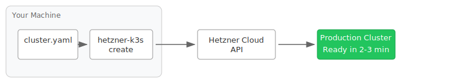

---

```
 _          _                            _    _____
| |__   ___| |_ _____ __   ___ _ __     | | _|___ / ___
| '_ \ / _ \ __|_  / '_ \ / _ \ '__|____| |/ / |_ \/ __|
| | | |  __/ |_ / /| | | |  __/ | |_____|   < ___) \__ \
|_| |_|\___|\__/___|_| |_|\___|_|       |_|\_\____/|___/
```

# The easiest and fastest way to create production-ready Kubernetes clusters on Hetzner Cloud

<p align="center">
  
</p>

## Table of Contents

- [Why hetzner-k3s?](#why-hetzner-k3s)
  - [How It Works](#how-it-works)
- [Why Hetzner Cloud + k3s?](#why-hetzner-cloud--k3s)
  - [Sample Monthly Costs](#sample-monthly-costs)
- [What Gets Installed](#what-gets-installed)
- [Quick Start](#quick-start)
- [Who Uses hetzner-k3s?](#who-uses-hetzner-k3s)
- [How It Compares](#how-it-compares)
- [Key Features](#key-features)
- [Documentation](#documentation)
- [Who am I?](#who-am-i)
- [Sponsors](#sponsors)
- [Contributing](#contributing)
- [License](#license)

---

## Why hetzner-k3s?

**hetzner-k3s** is a CLI tool that creates production-ready Kubernetes clusters on [Hetzner Cloud](https://hetzner.cloud/?ref=mqx6KKKwyook) in minutes, not hours. No Terraform to learn, no management cluster required, no third-party access to your credentials.

### Speed That Sets Records

- **3-node HA cluster in 2-3 minutes** — masters, workers, networking, and essential components all configured
- **500-node cluster in under 11 minutes** — tested with 3 masters and 497 workers (possibly a world record!)

### Simplicity Without Compromise

- **Single CLI tool** — no Terraform, Packer, Ansible, or existing Kubernetes cluster required
- **One YAML config file** — human-readable configuration, version-controllable
- **Batteries included** — Cloud Controller Manager, CSI driver, System Upgrade Controller, and Cluster Autoscaler installed automatically

### Complete Control, Zero Lock-in

- **Your credentials stay local** — Hetzner API token never leaves your machine
- **No third-party access** — unlike managed services, no one else can see your clusters or workloads
- **Open source (MIT License)** — inspect, modify, and contribute to the code
- **No recurring platform fees** — you only pay Hetzner for infrastructure

### How It Works

<p align="center">
  
</p>

No Terraform. No Packer. No Ansible. No management cluster. No third-party account. Your API token never leaves your machine.

---

## Why Hetzner Cloud + k3s?

### Hetzner Cloud: Exceptional Value

[Hetzner Cloud](https://hetzner.cloud/?ref=mqx6KKKwyook) offers the best performance-to-cost ratio in the industry:

- **Up to 80% lower costs** than AWS, Google Cloud, and Azure
- **Transparent pricing** — traffic, IPv4/IPv6, DDoS protection, and firewalls included
- **Global presence** — data centers in Germany (Nuremberg, Falkenstein), Finland (Helsinki), USA (Ashburn, Hillsboro), and Singapore
- **Flexible instance types** — x86 and ARM architectures, including cost-effective ARM instances (CAX) for budget-friendly clusters
- **Proven reliability** — trusted by companies worldwide for over 25 years

### k3s: Lightweight Kubernetes

[k3s](https://k3s.io/) by Rancher is a certified Kubernetes distribution optimized for resource efficiency:

- **Lower resource footprint** — uses less memory and CPU, leaving more for your workloads
- **Single binary** — fast to deploy and upgrade
- **Production-ready** — 99.8% successful automated updates in community benchmarks

### Sample Monthly Costs

Real infrastructure costs for common cluster configurations (December 2025 pricing):

| Cluster Type | Configuration | Monthly Cost |
|--------------|---------------|--------------|
| **Development** | 1 master (CX23), 2 workers (CX23) | ~€16/month |
| **Small Production** | 3 masters (CPX22), 3 workers (CPX32) | ~€58/month |
| **Medium Production** | 3 masters (CPX22), 10 workers (CPX32) | ~€135/month |
| **Large Production** | 3 masters (CPX42), 50 workers (CPX32) | ~€615/month |

*Includes load balancer (~€5.50/month). No management fees, no per-user fees—just infrastructure.*

**Compare to managed alternatives:**
- Equivalent AWS EKS: 3-5x higher infrastructure cost + $0.10/hour cluster fee (~$73/month)
- Managed Hetzner services (e.g. Cloudfleet): Infrastructure + platform fees that scale with cluster size and add up quickly

---

## What Gets Installed

When you run `hetzner-k3s create`, you get a complete, production-ready cluster:

| Component | Purpose |
|-----------|---------|
| **k3s** | Lightweight Kubernetes distribution |
| **[Hetzner Cloud Controller Manager](https://github.com/hetznercloud/hcloud-cloud-controller-manager)** | Automatic load balancer provisioning |
| **[Hetzner CSI Driver](https://github.com/hetznercloud/csi-driver)** | Persistent volumes via Hetzner block storage |
| **[System Upgrade Controller](https://github.com/rancher/system-upgrade-controller)** | Zero-downtime k3s upgrades |
| **[Cluster Autoscaler](https://github.com/kubernetes/autoscaler)** | Automatic node scaling based on demand |

All integrated with Hetzner's private networking and firewall. Traefik, ServiceLB, and metrics-server are available as optional add-ons.

---

## Quick Start

### 1. Install hetzner-k3s

**macOS (Homebrew):**
```bash
brew install vitobotta/tap/hetzner_k3s
```

**Linux (amd64):**
```bash
wget https://github.com/vitobotta/hetzner-k3s/releases/download/v2.4.3/hetzner-k3s-linux-amd64
chmod +x hetzner-k3s-linux-amd64
sudo mv hetzner-k3s-linux-amd64 /usr/local/bin/hetzner-k3s
```

See [Installation Guide](https://vitobotta.github.io/hetzner-k3s/Installation/) for all platforms.

### 2. Create a Configuration File

Create `cluster.yaml`:

```yaml
hetzner_token: <your-token>
cluster_name: my-cluster
kubeconfig_path: "./kubeconfig"
k3s_version: v1.32.0+k3s1

networking:
  ssh:
    port: 22
    use_agent: false
    public_key_path: "~/.ssh/id_ed25519.pub"
    private_key_path: "~/.ssh/id_ed25519"
  allowed_networks:
    ssh:
      - 0.0.0.0/0
    api:
      - 0.0.0.0/0

masters_pool:
  instance_type: cpx22
  instance_count: 3
  locations:
    - fsn1
    - hel1
    - nbg1

worker_node_pools:
- name: workers
  instance_type: cpx32
  instance_count: 3
  location: hel1
```

### 3. Create Your Cluster

```bash
hetzner-k3s create --config cluster.yaml
```

In 2-3 minutes, your cluster is ready. The kubeconfig is saved automatically.

```bash
export KUBECONFIG=./kubeconfig
kubectl get nodes
```

---

## Who Uses hetzner-k3s?

- **Startups** running cost-efficient production workloads
- **Development teams** spinning up ephemeral test clusters
- **Agencies and consultants** deploying client infrastructure quickly
- **Companies** in regulated industries requiring data sovereignty
- **Platform engineers** who want simplicity without sacrificing control

Join an active community with 3,100+ GitHub stars and regular contributions.

---

## How It Compares

| Factor | hetzner-k3s | Managed Services | Terraform-based |
|--------|-------------|------------------|-----------------|
| **Setup time** | 2-3 minutes | 5-10 minutes | 15-30+ minutes |
| **Dependencies** | CLI tool only | Third-party account* | Terraform, Packer, HCL knowledge |
| **Data privacy** | Full control | Third-party access | Full control |
| **Monthly cost** | Infrastructure only | Infrastructure + fees | Infrastructure only |
| **Credential exposure** | None | API tokens to third party | None |
| **Learning curve** | Low | Low | Medium-High |

*Managed services (Cloudfleet, Edka, etc.) require signing up for their platform in addition to Hetzner Cloud.

For a detailed comparison, see [Why hetzner-k3s Stands Out](https://vitobotta.github.io/hetzner-k3s/Comparison_with_other_tools/).

---

## Key Features

### High Availability
Deploy masters and worker pools across multiple locations for regional resilience.

### Autoscaling
Define min/max instances per node pool. The Cluster Autoscaler handles the rest.

```yaml
worker_node_pools:
- name: autoscaled
  instance_type: cpx32
  location: fsn1
  autoscaling:
    enabled: true
    min_instances: 1
    max_instances: 10
```

### Multiple Node Pools
Mix instance types and locations for different workloads. Hetzner offers x86 and ARM instances at various performance levels—including cost-effective ARM instances (CAX) ideal for budget-friendly clusters.

### Private Networking
Cluster communication over Hetzner's private network by default.

### CNI Options
Choose Flannel (simple) or Cilium (advanced networking features).

### Large Cluster Support
Tested with 500 nodes and designed to scale beyond. Clusters over 100 nodes require some configuration changes (see [Recommendations](https://vitobotta.github.io/hetzner-k3s/Recommendations/)).

---

## Documentation

Full documentation: **[vitobotta.github.io/hetzner-k3s](https://vitobotta.github.io/hetzner-k3s/)**

- [Installation](https://vitobotta.github.io/hetzner-k3s/Installation/)
- [Creating a Cluster](https://vitobotta.github.io/hetzner-k3s/Creating_a_cluster/)
- [Setting Up a Complete Stack](https://vitobotta.github.io/hetzner-k3s/Setting_up_a_cluster/)
- [Cluster Maintenance](https://vitobotta.github.io/hetzner-k3s/Maintenance/)
- [Recommendations for Production](https://vitobotta.github.io/hetzner-k3s/Recommendations/)
- [Troubleshooting](https://vitobotta.github.io/hetzner-k3s/Troubleshooting/)

---

## Who am I?

I'm Vito Botta, Lead Platform Architect at [Brella](https://www.brella.io/), an event management platform based in Finland. I handle infrastructure, coding, and support for the development team.

I also spend time as a bug bounty hunter, finding and responsibly reporting security vulnerabilities.

Connect with me at [vitobotta.com](https://vitobotta.com/). I'm available for consultancies around hetzner-k3s and Kubernetes on Hetzner.

---

## Sponsors

Your support helps keep this project actively maintained. Consider [sponsoring development](https://github.com/sponsors/vitobotta).

### Platinum Sponsors

<a href="https://alamos.gmbh"></a>

A special thank you to [Alamos GmbH](https://alamos.gmbh) for sponsoring the development of key features!

### Backers

Thanks to [@deubert-it](https://github.com/deubert-it), [@jonasbadstuebner](https://github.com/jonasbadstuebner), [@ricristian](https://github.com/ricristian), [@QuentinFAIDIDE](https://github.com/QuentinFAIDIDE) for their support!

---

## Contributing

Contributions are welcome! See [Contributing and Support](https://vitobotta.github.io/hetzner-k3s/Contributing_and_support/) for guidelines.

## Code of Conduct

Everyone interacting in this project is expected to follow the [code of conduct](https://github.com/vitobotta/hetzner-k3s/blob/main/CODE_OF_CONDUCT.md).

## License

Open source under the [MIT License](https://github.com/vitobotta/hetzner-k3s/blob/main/LICENSE.txt).

---

## Star History

[](https://starchart.cc/vitobotta/hetzner-k3s)
